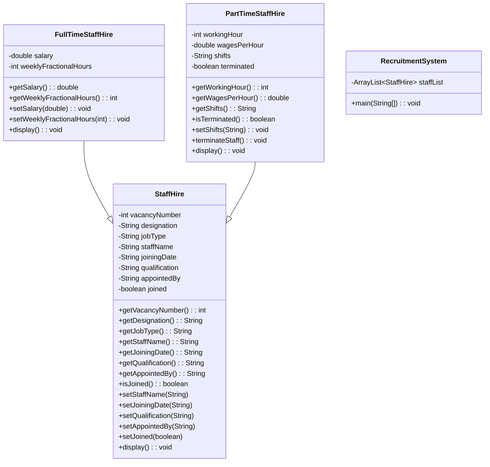

# CS4001 – Final Report

https://github.com/etwodev/london-met-coursework

## Architecture

### Class Diagram

---

## Classes and Their Responsibilities

---

### **1. StaffHire**

**Purpose:**
Acts as the abstract or base class representing a general staff hire entry, holding common attributes shared between full-time and part-time staff.

**Key Properties:**

* `int vacancyNumber` – Unique identifier for the staff vacancy
* `String designation` – The job title or designation of the vacancy
* `String jobType` – Type of job: Permanent, Temporary, or Contract
* `String staffName` – Name of the staff hired
* `String joiningDate` – Date on which the staff joined
* `String qualification` – Educational qualification of the staff
* `String appointedBy` – Name of the person who appointed the staff
* `boolean joined` – Indicates whether the staff has joined or not

**Key Methods:**

* `getters/setters` – Standard accessor and mutator methods for all fields
* `setJoined(boolean)` – Allows updating the joined status
* `display()` – Outputs staff hire details (base class version)

---

### **2. FullTimeStaffHire**

**Purpose:**
Represents a full-time staff member and extends the `StaffHire` class by adding salary and working hours.

**Key Properties:**

* `double salary` – Annual salary for the staff member
* `int weeklyFractionalHours` – Number of hours worked per week

**Key Methods:**

* `getSalary()` / `setSalary(double)` – Accesses or updates the salary. Updates only if staff has joined
* `getWeeklyFractionalHours()` / `setWeeklyFractionalHours(int)` – Accesses or updates working hours
* `display()` – Outputs full-time staff details, including base class and subclass-specific attributes

---

### **3. PartTimeStaffHire**

**Purpose:**
Represents a part-time staff member and extends the `StaffHire` class with shift, wages, working hours, and termination details.

**Key Properties:**

* `int workingHour` – Number of hours worked per day
* `double wagesPerHour` – Wage earned per hour
* `String shifts` – Assigned work shift (e.g., Morning, Day, Evening)
* `boolean terminated` – Indicates if the staff member has been terminated

**Key Methods:**

* `getters/setters` – Standard accessors and mutators for new fields
* `setShifts(String)` – Updates working shifts if the staff has joined
* `terminateStaff()` – Marks the staff as terminated and clears relevant personal details
* `display()` – Outputs part-time staff details and calculates income per day

---

### **4. RecruitmentSystem**

**Purpose:**
Serves as the graphical user interface (GUI) controller and main entry point of the application.

**Key Properties:**

* `ArrayList<StaffHire> staffList` – Stores all staff hire objects
* `GUI components` – Includes text fields, labels, buttons for all relevant inputs and actions

**Key Methods:**

* `main(String[] args)` – Launches the GUI
* `addFullTimeStaff()` – Creates and adds a full-time staff member based on user input
* `addPartTimeStaff()` – Creates and adds a part-time staff member based on user input
* `setSalaryForFullTime()` – Sets salary for a full-time staff member by vacancy number
* `setShiftForPartTime()` – Updates shifts for a part-time staff member by vacancy number
* `terminatePartTimeStaff()` – Terminates a part-time staff member by vacancy number
* `displayStaffDetails()` – Displays all details of a selected staff member
* `clearFields()` – Resets all text fields in the GUI for fresh input

---

Certainly. Below is a modified version of the **Data Structures Used**, **Algorithms Implemented**, and **Reflection** sections tailored specifically for your **Recruitment System** Java project:

---

## **Data Structures Used**

| Data Structure         | Location(s)                              | Purpose                                                                |
| ---------------------- | ---------------------------------------- | ---------------------------------------------------------------------- |
| `ArrayList<StaffHire>` | `RecruitmentSystem`                      | Store and manage all staff entries (full-time and part-time)           |
| `String`               | All classes                              | Store textual attributes like designation, job type, and staff details |
| `boolean`              | `StaffHire`, `PartTimeStaffHire`         | Track joined and termination status of staff                           |
| `int`, `double`        | `FullTimeStaffHire`, `PartTimeStaffHire` | Represent numeric fields such as salary, wages, and working hours      |

---

## **Algorithms Implemented**

### 1. **Linear Search**

**Location:**

* `RecruitmentSystem` methods (e.g., `setSalaryForFullTime`, `setShiftForPartTime`, `terminatePartTimeStaff`)

**Use Case:**
Find a staff object by matching the vacancy number within the `ArrayList<StaffHire>`.

**Justification:**
Since the number of vacancies is relatively small, a linear search is acceptable and keeps implementation simple. For larger datasets, this could be optimized using a `Map<Integer, StaffHire>` or a more advanced index structure.

---

## **Reflection**

The hardest aspect of this project was designing the class hierarchy to be flexible. Ensuring that common properties were encapsulated in the base class (`StaffHire`).

Another complexity was the GUI development using Swing. I opted to encapsulate much of the logic behind action listeners to keep the UI code as readable as possible.

There is room for improvement in terms of exception handling and form input validation. Currently, the application uses simple `try-catch` blocks and message dialogs.
