# Banking Application – Final Report

## Instructions

To load the project into NetBeans:

1. Open NetBeans
2. Navigate to: **File > New Project**
3. Select: **Java > Java with Ant > Java Project with Existing Sources**
4. Click **Next**
5. Name the project appropriately
6. Set the **Project Location** to the root folder containing `.gitignore`
7. Click **Next**
8. Add the `src` directory as the **Source Package Folder**
9. Set the **Main Class** to `src/BankApp.java`

---

## Architecture

### Class Diagram

> All classes and code in this project were developed independently. No third-party code or textbook implementations were used beyond standard Java libraries.

```mermaid
classDiagram
  class BankApp {
    -Scanner scanner
    +main(String[]): void
    -manageAccountsMenu(): void
    -viewTransactionsMenu(): void
  }

  class CommandService {
    -BankService bank
    -Scanner scanner
    -getStrInput(String): String
    -getIntInput(String): Integer
    -getDoubleInput(String): Double
    +create(): void
    +deposit(): void
    +withdraw(): void
    +send(): void
    +listAccounts(): void
    +close(): void
    +account(): void
    +listTransactions(): void
    +searchTransactions(): void
  }

  class BankService {
    -List~BankAccount~ accounts
    -int nextAccountId
    +createAccount(String, String): BankAccount
    +deposit(int, double): boolean
    +withdraw(int, double): boolean
    +listAccounts(): List~BankAccount~
    +closeAccount(int): boolean
    +send(int, int, double): boolean
    +getAllTransactions(): List~Transaction~
    +binarySearch(List~T~, K, Function): T
    +getAccount(int): BankAccount
  }

  class BankAccount {
    -int accoundId
    -String holderName
    -String holderAddress
    -Date openingDate
    -double balance
    -TransactionQueue transactions
    +deposit(double): boolean
    +withdraw(double): boolean
    +addTransaction(Transaction): void
    +getBalance(): double
    +getAccountId(): int
    +getHolderName(): String
    +getHolderAddress(): String
    +getOpeningDate(): Date
    +getTransactions(): List~Transaction~
  }

  class Transaction {
    -TransactionType type
    -float amount
    -Date date
    -Integer fromAccountId
    -Integer toAccountId
    +getAmount(): float
    +getFromAccountId(): Integer
    +getToAccountId(): Integer
    +getType(): TransactionType
    +getDate(): Date
  }

  class TransactionQueue {
    -int capacity
    -List~Transaction~ transactions
    +enqueue(Transaction): void
    +getAll(): List~Transaction~
    +size(): int
    +isEmpty(): boolean
  }

  class TransactionType {
    <<enum>>
    WITHDRAW
    DEPOSIT
    SEND
    REQUEST
    RECEIVE
    +getValue(): String
    +fromString(String): TransactionType
  }

  BankApp --> CommandService
  CommandService --> BankService
  BankService --> BankAccount
  BankAccount --> TransactionQueue
  BankAccount --> Transaction
  TransactionQueue --> Transaction
  Transaction --> TransactionType
```

---

## Classes and Their Responsibilities

### 1. `BankApp`

**Purpose:**
Serves as the main entry point of the application.

**Key Properties:**

* `Scanner scanner` – For collecting CLI user input

**Key Methods:**

* `main(String[] args)` – Initializes and launches the CLI
* `manageAccountsMenu()` – Manages the account-related CLI options
* `viewTransactionsMenu()` – Manages the transaction-related CLI options

---

### 2. `CommandService`

**Purpose:**
Acts as the command handler for CLI inputs and delegates business logic to the `BankService`.

**Key Properties:**

* `BankService bank` – Central logic handler
* `Scanner scanner` – For user input

**Helper Methods:**

* `getStrInput(String message)` – Accepts string input from the user
* `getIntInput(String message)` – Accepts integer input
* `getDoubleInput(String message)` – Accepts double input

**Command Methods:**

* `create()` – Creates a new bank account
* `deposit()` – Deposits funds into an account
* `withdraw()` – Withdraws funds from an account
* `send()` – Transfers funds between accounts
* `listAccounts()` – Displays all accounts
* `close()` – Closes an account with a zero balance
* `account()` – Displays account details
* `listTransactions()` – Lists all transactions
* `searchTransactions()` – Searches transactions by amount

---

### 3. `BankService`

**Purpose:**
Data management class for accounts and transactions.

**Key Properties:**

* `List<BankAccount> accounts` – Stores active accounts
* `int nextAccountId` – Tracks the next account ID

**Key Methods:**

* `createAccount(...)`
* `deposit(...)`
* `withdraw(...)`
* `closeAccount(...)`
* `send(...)`
* `listAccounts()`
* `getAllTransactions()`
* `binarySearch(...)` – Searches transactions by amount
* `getAccount(...)` – Retrieves account by ID

---

### 4. `BankAccount`

**Purpose:**
Represents an individual bank account and its associated transactions.

**Key Properties:**

* `int accountId`
* `String holderName`
* `String holderAddress`
* `Date openingDate`
* `double balance`
* `TransactionQueue transactions`

**Key Methods:**

* `deposit(...)`
* `withdraw(...)`
* `addTransaction(...)`
* `getTransactions()`
* Standard getters

---

### 5. `Transaction`

**Purpose:**
Stores the details of a single transaction.

**Key Properties:**

* `TransactionType type`
* `float amount`
* `Date date`
* `Integer fromAccountId`
* `Integer toAccountId`

**Key Methods:**

* `toString()` – String representation of the transaction
* Standard getters

---

### 6. `TransactionQueue`

**Purpose:**
A custom fixed-size FIFO queue to store recent transactions for each account.

**Key Properties:**

* `int capacity`
* `List<Transaction> transactions`

**Key Methods:**

* `enqueue(Transaction)`
* `getAll()`
* `size()`
* `isEmpty()`

---

### 7. `TransactionType`

**Purpose:**
An enumeration of all valid transaction types.

**Enum Constants:**

* `WITHDRAW`, `DEPOSIT`, `SEND`, `REQUEST`, `RECEIVE`

**Key Methods:**

* `getValue()` – Returns string name
* `fromString(String)` – Parses string to enum
* `toString()` – Returns display name

---

## Data Structures Used

| Data Structure             | Location(s)            | Purpose                                    |
| -------------------------- | ---------------------- | ------------------------------------------ |
| `List<BankAccount>`        | `BankService`          | Store and manage bank accounts             |
| `List<Transaction>`        | `BankAccount`, `Queue` | Record transactions                        |
| `TransactionQueue`         | `BankAccount`          | Maintain a limited history of transactions |
| `Enum` (`TransactionType`) | `Transaction`          | Classify transaction types safely          |

---

## Algorithms Implemented

### 1. **Binary Search**

**Location:**

* `BankService.binarySearch(...)`

**Use Case:**
Efficiently search for a transaction by amount within a sorted transaction list.

**Justification:**
Binary search provides logarithmic search performance when the data is pre-sorted, which is ideal for improving lookup speed in potentially large transaction lists.

---

## Reflection

The most challenging aspect of this project was managing scope. It was easy to fall into the trap of adding unnecessary features or over-engineering components just for the sake of readability. Recognizing when to stop and solidify what was already built was a key learning moment. I also believe I could improve my code by implementing custom error handling through Generic errors. This way I can throw errors in my BankService class and use a switch statement on the errors in my CommandService class to give more context to the user besides just "Transaction Failed.". Currently the implementation does not give much feedback as to why a command failed. Beyond this, I learnt a decent amount Java facts that I would like to implement more of in the future when programming (Such as the fact that Java has Ternary Operators).
